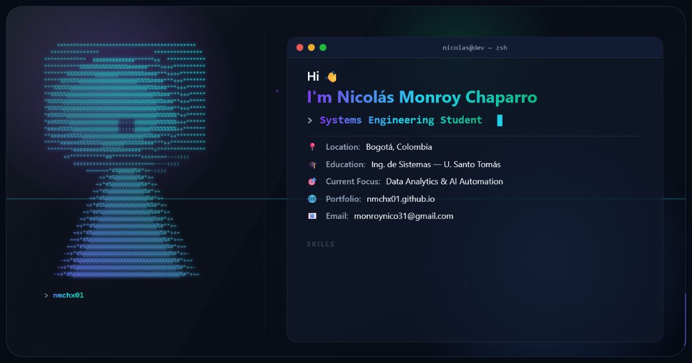

# Nicolás Monroy Chaparro — Portafolio personal



Portafolio profesional de Nicolás Monroy Chaparro, enfocado en ingeniería de datos, analítica, automatización con IA, arquitecturas RAG y seguridad de LLMs.
## Stack

- HTML5 semántico y CSS3.
- JavaScript ES6+ sin framework ni proceso de compilación.
- Canvas API, Intersection Observer y animaciones CSS.
- Three.js r128 cargado bajo demanda desde cdnjs para el teclado 3D.
- Google Fonts como recurso web externo.
- Hosting estático compatible con GitHub Pages y Vercel.

El proyecto no usa Node.js en runtime, `package.json`, base de datos, funciones serverless ni almacenamiento persistente.

## Estructura

```text
.
├── index.html               # Página principal
├── 404.html                 # Página de error personalizada
├── js/                      # Comportamiento y visualización 3D
├── images/                  # Imágenes optimizadas, iconos y portada social
├── files/                   # Hojas de vida descargables
├── favicon.svg
├── robots.txt
├── sitemap.xml
├── vercel.json              # Headers de seguridad y caché
└── .env.example             # Inventario de variables de entorno
```

## Configuración local

No hay dependencias que instalar.

1. Clona el repositorio y entra en su directorio:

   ```bash
   git clone https://github.com/nmchx01/nmchx01.github.io.git
   cd nmchx01.github.io
   ```

2. Sirve la raíz con cualquier servidor HTTP estático. Por ejemplo, si tienes Python:

   ```bash
   python -m http.server 4173
   ```

3. Abre `http://localhost:4173/`.

Abrir `index.html` directamente permite una revisión básica, pero un servidor local reproduce mejor el comportamiento de rutas y recursos de producción.

## Variables de entorno

Actualmente no se requiere ninguna variable en Development, Preview ni Production. El archivo [`.env.example`](.env.example) mantiene explícito este inventario.

Si se incorpora una API o servicio externo, documenta allí cada nombre y propósito sin incluir valores reales. Las variables privadas nunca deben exponerse en JavaScript del navegador.

## Verificación antes de desplegar

Este sitio no tiene pasos de instalación o build. Las comprobaciones disponibles son:

```bash
node --check js/main.js
node --check js/keyboard-loader.js
node --check js/keyboard3d.js
git diff --check
```

Además, revisa manualmente la portada, navegación móvil, teclado 3D, enlaces externos, descargas de CV y página `404.html`.

## Despliegue en Vercel

1. En Vercel, selecciona **Add New → Project** e importa `nmchx01/nmchx01.github.io`.
2. Usa estas opciones:
   - **Production Branch:** `main`.
   - **Framework Preset:** `Other`.
   - **Root Directory:** `.`.
   - **Install Command:** vacío.
   - **Build Command:** vacío.
   - **Output Directory:** vacío; Vercel sirve la raíz del repositorio.
3. No agregues variables de entorno: no se requiere ninguna para Development, Preview o Production.
4. Despliega y verifica la URL temporal asignada por Vercel.
5. En **Settings → Domains**, conecta el dominio definitivo y configura los registros DNS indicados por Vercel.

`vercel.json` aplica headers de seguridad y políticas de caché a los recursos estáticos. No se configura una versión de Node porque el sitio no ejecuta Node ni tiene fase de build.

### Dominio canónico

Los metadatos SEO, `robots.txt` y `sitemap.xml` apuntan actualmente a `https://nmchx01.github.io/`. Si Vercel será el dominio público principal, reemplaza esa URL en los siguientes archivos antes de promocionar el despliegue:

- `index.html`
- `robots.txt`
- `sitemap.xml`

Después del cambio, configura una redirección permanente desde el dominio secundario para evitar contenido duplicado.

## Checklist de publicación

- [ ] El deployment de Vercel termina correctamente.
- [ ] La página principal, `404.html`, favicon, sitemap, robots y portada social responden.
- [ ] Los headers definidos en `vercel.json` están presentes.
- [ ] Las descargas de los CV funcionan.
- [ ] El teclado 3D carga y la página sigue siendo utilizable si el CDN no responde.
- [ ] El dominio canónico coincide con el dominio público definitivo.
- [ ] El dominio personalizado y HTTPS aparecen como válidos en Vercel.
- [ ] No existen variables de entorno o secretos innecesarios en el dashboard.

## Contacto

- Email: [monroynico31@gmail.com](mailto:monroynico31@gmail.com)
- LinkedIn: [nicolas-monroy-chaparro](https://www.linkedin.com/in/nicolas-monroy-chaparro-08107a375)
- GitHub: [@nmchx01](https://github.com/nmchx01)

## Convención de commits

El repositorio usa [Conventional Commits](https://www.conventionalcommits.org/): `feat:`, `fix:`, `refactor:`, `perf:`, `docs:` y `chore:`.
